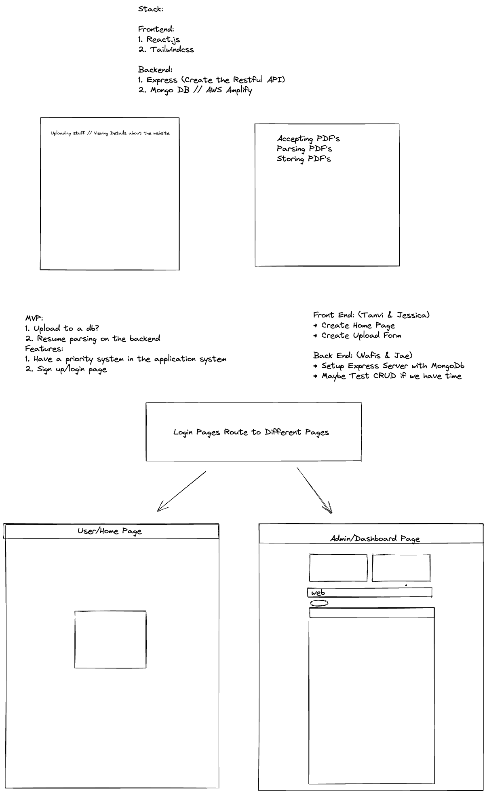
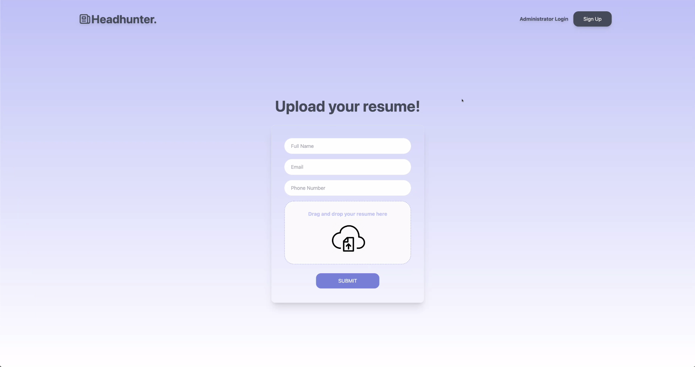
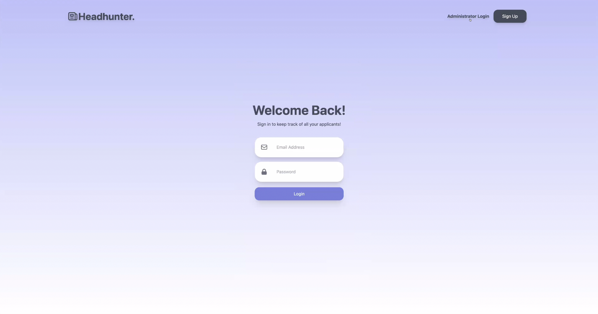
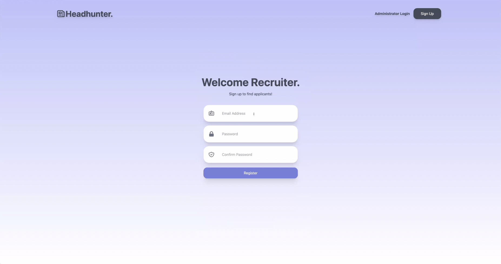
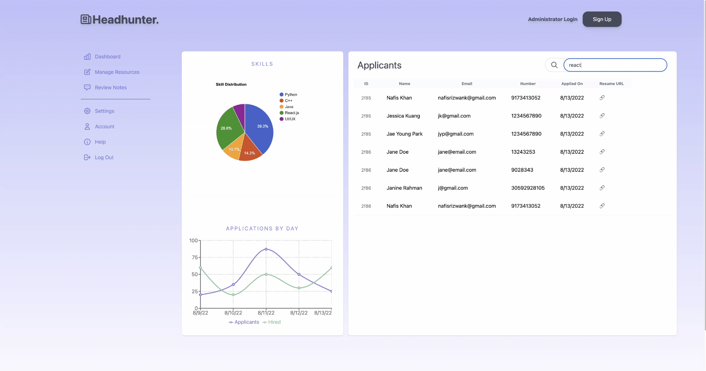

# HeadHunter.

- HeadHunter is a full stack website that enables users to apply directly to recruiter at multiple companies all at once.
- All users/job-seekers upload their resumes with past work experience and skill-set they have acquired through previous experiences.
- Recruiters/Administrators sign-up to Headhunter to get access to job-seekers. 
  - They are able to see what skills are currently trending in the employment market
  - Search for users with specific skills and get access to their information to talk to them directly.

---

## Development
- To run this project, use `npm install` in both server and client directory. Then use `npm start` in the server folder and then follow up with `npm start` in the client folder to start the project. 

### Technology Stack:

- Frontend:
  - React.js
  - Tailwind CSS
- Backend:
  - Node.js
  - Express.js
  - MongoDB
- Some minor mentions:
  - bcrypt for User Password Security
  - pdfparse for parsing pdfs and analyzing data
  - Heroicons for icons
  - React Google Charts for creating charts
  - express-fileupload for handling larger files

### Initial Sketch:👇

### Figma Sketches & Site:

- 
Home Screen:👇

- 
Login Screen:👇

- 
Recruiter Sign-Up Screen:👇

- 
Admin Screen:👇

---

## Meeting Notes:

### Meeting 1: 
  - Decided On Basic Layout
  - Stack: React // TailwindCSS for Frontend || Express // MongoDB for Backend
  - Main Goal Set: Home & Admin Pages without Routing 
  - Features: 
             - Login Page
             - Search Priority System

  Work: 
  Frontend (Tanvi && Jessica):
  - Create a Home Page with a Card containing reading in User Info and PDF File

  Backend (Nafis && Jae):
  - Setup Express Server
  - Setup MongoDB Account
  - Test CRUD operations if possible

  UI/UX(Diana):
  - Taking Layout and creating a user friendly design for users

  Meeting Attendance Link:
  - https://docs.google.com/spreadsheets/d/1Acik5wLY_fA-XBfckGKHq2QRD5p9DUYaLoCRz4-WeNs/edit?usp=sharing

  List of Helpful Videos:
  - https://docs.google.com/spreadsheets/d/1BBtSKoBze4ncQw9j_YALHQiFk8kJt-W2hkUCgXXV6Tw/edit?usp=sharing
  
  
### Meeting 2:
  
  Front-end Update:
  - added login
  - added home
  - added admin

  Back-end Update:
  - Database Connection Established
  - Parsing Section Completed

  UI/UX:
  - Currently working on design 
  
### Meeting 3:

  Friday:
  - Create User Authentication in Backend (Jae)
  - Connect Frontend Login with Backend (Nafis)

  - Display Resumes on Admin Console (Tanvi, Nafis)
  - Implement Search Features (Tanvi, Jessica)
  - (maybe add a dashboard/table--Nafis/anyone else)
  
  Saturday:
  - Change frontend to Diana's Design (Saturday)

